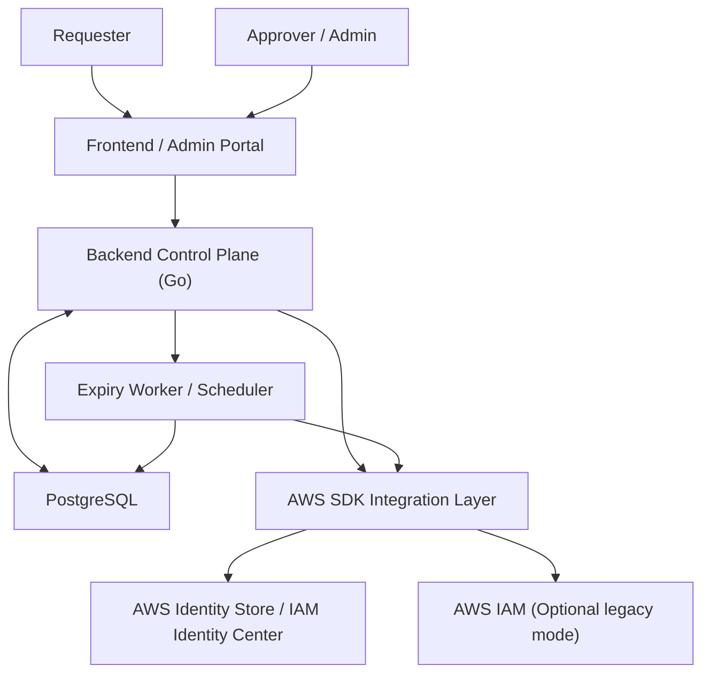
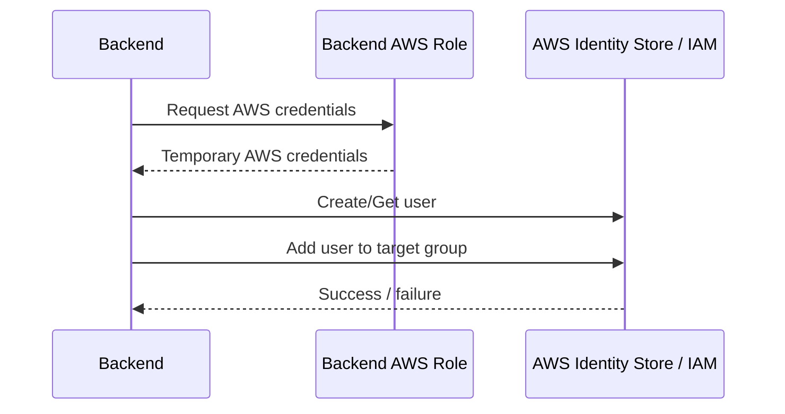
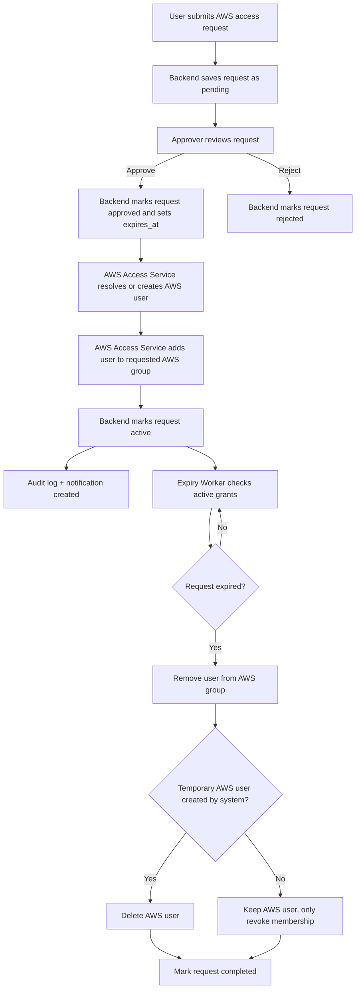
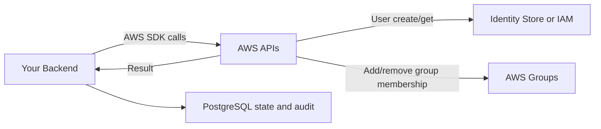
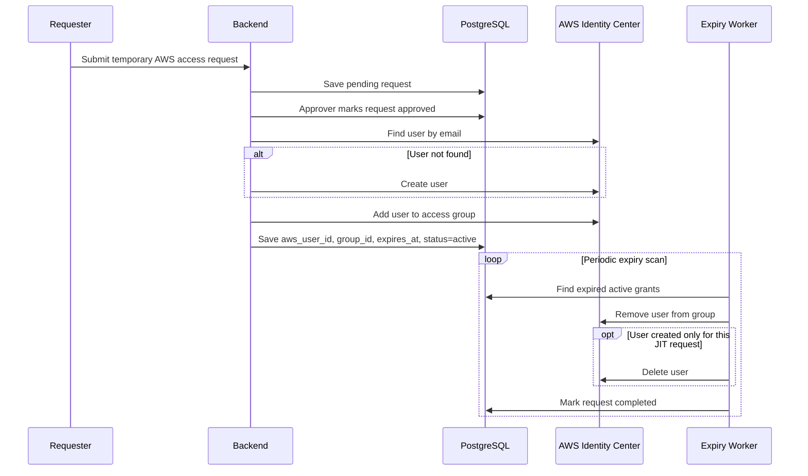
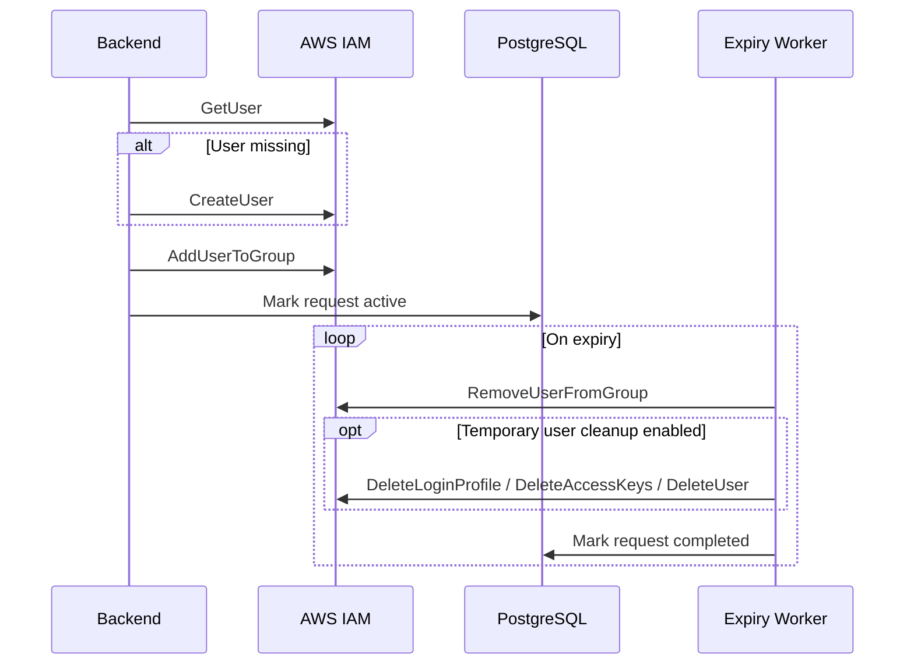

# AWS JIT PAM Access Management

### Technical Design Document

**Author:** Manish Jangra  
**Purpose:**  
Extend the current JIT SSH control plane into a PAM-style AWS access system that grants a user temporary AWS access by placing them into a specific AWS group and automatically removing that access after expiry.

---

# 1. Goal

Today your project handles temporary server access like this:

1. User requests SSH access
2. Approver approves it
3. Agent creates the user on the server
4. Agent removes the user after expiry

For AWS PAM, we want the same business flow, but the enforcement target changes:

1. User requests temporary AWS access
2. Approver approves it
3. Backend grants AWS access by creating or resolving the AWS user
4. Backend adds the user to the requested AWS group
5. Background expiry worker removes the user from the group after TTL
6. Optional cleanup deletes the temporary AWS user if it was created only for this request

---

# 2. Recommended AWS Model

For AWS access, the recommended model is:

- Use the existing backend as the control plane
- Do not use a host agent
- Backend talks directly to AWS APIs using the AWS SDK for Go
- Grant access by adding the user to an AWS access group
- Revoke access by removing the user from that group at expiry

There are two possible AWS implementations:

## Option A. Recommended: AWS IAM Identity Center

Use:

- Identity Store user
- Identity Store group
- Permission Set assignment through group membership

Flow:

- Backend finds or creates the user in AWS Identity Store
- Backend adds the user to the configured group
- That group already maps to AWS account access through IAM Identity Center
- On expiry, backend removes the user from the group

This is the better enterprise PAM design.

## Option B. Alternative: IAM User + IAM Group

Use only if your organization is still using IAM users directly.

Flow:

- Backend creates an IAM user
- Backend adds the IAM user to a specific IAM group
- Optional: backend creates console password or access keys
- On expiry, backend removes the IAM user from the group
- Optional: backend deletes the IAM user if it was created just for temporary access

This works, but it is less preferred than Identity Center for modern AWS environments.

---

# 3. High-Level Architecture

Core point:

- In the SSH design, backend delegates execution to the server agent
- In the AWS PAM design, backend itself is the executor

So the backend replaces the agent for AWS actions.

---

# 4. System Components

## 1. Frontend

New PAM request screens allow a user to request:

- AWS account or environment
- Access group
- Duration
- Justification

Admin screens allow:

- Approve or reject requests
- Revoke active AWS access
- View granted groups and expiry times
- View AWS access audit logs

## 2. Backend Control Plane

Responsibilities:

- Accept AWS access requests
- Run approval workflow
- Call AWS APIs
- Track expiry
- Revoke access automatically
- Keep full audit history

## 3. AWS Integration Service

A backend service module that wraps AWS SDK calls.

Responsibilities:

- Resolve user by email or username
- Create user if not found
- Add user to group
- Remove user from group
- Delete temporary user if configured
- Write operation results back to DB

## 4. Expiry Worker

A periodic backend job that:

- Scans approved and active AWS access grants
- Finds expired entries
- Removes the user from the AWS group
- Marks the grant as expired or completed
- Deletes temporary AWS users if cleanup policy requires it

---

# 5. How Backend Connects To AWS

The backend should run with an AWS execution identity, for example:

- EC2 instance role
- ECS task role
- EKS service account role
- Secure AWS access keys stored in secrets manager

Recommended:

- Use an IAM role attached to the backend runtime
- Avoid hardcoding credentials in config files

Example backend connection flow:

Backend code structure can look like this:

- `internal/awsclient/identity_center.go`
- `internal/awsclient/iam.go`
- `internal/services/aws_access_service.go`
- `internal/jobs/aws_expiry_worker.go`

---

# 6. End-to-End Access Lifecycle

## Request Phase

1. User opens the portal
2. User selects AWS application, account, or group
3. User chooses TTL such as `1h`, `4h`, or `8h`
4. User submits reason
5. Backend stores request as `pending`

## Approval Phase

1. Admin opens approval queue
2. Admin approves request
3. Backend sets:
   - `status = approved`
   - `expires_at = now + duration`
4. Backend triggers AWS grant workflow

## Grant Phase

1. Backend resolves whether AWS user already exists
2. If user does not exist, backend creates the AWS user
3. Backend adds the user to the requested AWS group
4. Backend stores:
   - AWS user ID
   - group ID
   - whether user was newly created
   - grant timestamp
5. Backend marks request `active`
6. Backend creates audit log and notification

## Expiry / Revoke Phase

1. Expiry worker finds records where `expires_at <= now`
2. Backend removes user from AWS group
3. If `created_by_system = true` and cleanup policy allows:
   - backend deletes the AWS user
4. Backend marks request `expired` or `completed`
5. Backend creates audit log and notification

---

# 7. Detailed Flow Diagram

---

# 8. Backend and AWS Interaction Without Agent

In the SSH design:

- Backend decides
- Agent executes on the server

In the AWS PAM design:

- Backend decides
- Backend executes directly against AWS

So the connection is:

This means:

- no server-side AWS agent is required
- all action orchestration stays inside the backend
- expiry cleanup is handled by a backend scheduler or worker

---

# 9. Suggested Database Additions

To support AWS PAM, add a dedicated table instead of overloading SSH-only fields.

## Table: `aws_access_requests`

Suggested columns:

- `id`
- `user_id`
- `cloud_provider` = `aws`
- `aws_account_id`
- `aws_region`
- `target_group_name`
- `target_group_id`
- `aws_username`
- `aws_user_id`
- `access_mode`
- `duration`
- `status`
- `reason`
- `approved_by`
- `approved_at`
- `expires_at`
- `created_by_system`
- `cleanup_policy`
- `created_at`
- `updated_at`

### Status values

- `pending`
- `approved`
- `active`
- `rejected`
- `revoked`
- `expired`
- `completed`
- `failed`

### cleanup_policy examples

- `remove_membership_only`
- `remove_membership_and_delete_user`

---

# 10. Suggested Backend Modules

## API Layer

Suggested endpoints:

- `POST /api/v1/aws-requests`
- `GET /api/v1/aws-requests`
- `POST /api/v1/aws-requests/:id/approve`
- `POST /api/v1/aws-requests/:id/revoke`
- `GET /api/v1/aws-groups`
- `GET /api/v1/aws-accounts`

## Service Layer

Suggested services:

- `AWSAccessService`
- `AWSIdentityCenterService`
- `AWSIAMService`
- `AWSExpiryService`

## Worker Layer

Suggested jobs:

- `ProcessApprovedAWSRequests`
- `ExpireAWSAccessGrants`
- `RetryFailedAWSOperations`

---

# 11. Identity Center Flow

If you use IAM Identity Center, the detailed flow is:

---

# 12. IAM User Flow

If you must use direct IAM users:

Important note:

- IAM user deletion requires removing dependent resources first
- For IAM users, cleanup is more complex than Identity Center

---

# 13. Expiry Strategy

Do not rely on AWS to auto-expire the group membership by itself.

Use a backend job every 1 to 5 minutes:

1. Query all AWS grants where:
   - `status in ('approved', 'active', 'revoked')`
   - `expires_at <= now`
2. Call AWS remove-membership API
3. Optionally delete temporary user
4. Save result
5. Retry failed operations with backoff

Recommended worker behavior:

- idempotent actions
- retry on throttling
- distributed lock if multiple backend replicas exist
- write all failures to audit log

---

# 14. Security Controls

## Backend to AWS

- Backend role should have only minimum required permissions
- Restrict create/delete actions to approved identity store or IAM paths
- Restrict allowed group IDs through DB configuration, not arbitrary user input

## Approval Controls

- Requestor cannot self-approve
- Team-based or manager-based approvals
- Dual approval for sensitive groups such as production admin

## Audit Controls

Log every event:

- request created
- request approved
- AWS user created
- group membership granted
- group membership removed
- AWS user deleted
- revoke or failure reason

---

# 15. AWS Permission Scope Needed

Exact policies depend on whether you use Identity Center or IAM, but the backend execution role will need permissions for:

## Identity Center path

- read users
- create users
- read groups
- create group memberships
- delete group memberships
- optional delete users

## IAM path

- `iam:GetUser`
- `iam:CreateUser`
- `iam:DeleteUser`
- `iam:AddUserToGroup`
- `iam:RemoveUserFromGroup`
- `iam:ListGroupsForUser`
- `iam:ListAccessKeys`
- `iam:DeleteAccessKey`
- `iam:DeleteLoginProfile`

Grant only the minimum resources required.

---

# 16. Failure Handling

Examples:

- AWS user creation succeeded but group add failed
  - mark request failed
  - optionally roll back by deleting created user

- Group removal failed during expiry
  - keep status as `expiry_failed`
  - retry in next worker run
  - alert admin

- Backend restarted mid-operation
  - use DB state to resume safely
  - design all grant and revoke operations to be idempotent

---

# 17. Recommended Implementation Order

1. Create new AWS access request model and table
2. Add frontend request form for AWS access
3. Add admin approval UI
4. Build AWS SDK integration service
5. Implement approve flow
6. Implement expiry worker
7. Add audit and notification events
8. Add retries, idempotency, and failure dashboards

---

# 18. Final Design Summary

Your current SSH JIT model is:

- Backend = decision maker
- Agent = executor on the target server

Your AWS PAM model should be:

- Backend = decision maker
- Backend = executor against AWS

So for AWS:

- no agent is needed
- backend talks directly to AWS
- access is granted by temporary group membership
- expiry is enforced by a backend worker
- optional user deletion is done only if the user was created solely for temporary access

For production, the strongest design is:

- AWS IAM Identity Center
- group-based access
- temporary membership
- backend-managed expiry
- full audit logging
