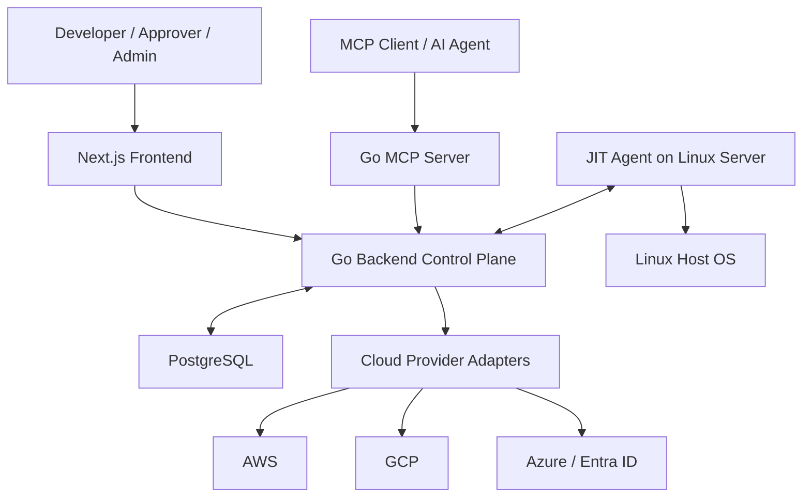
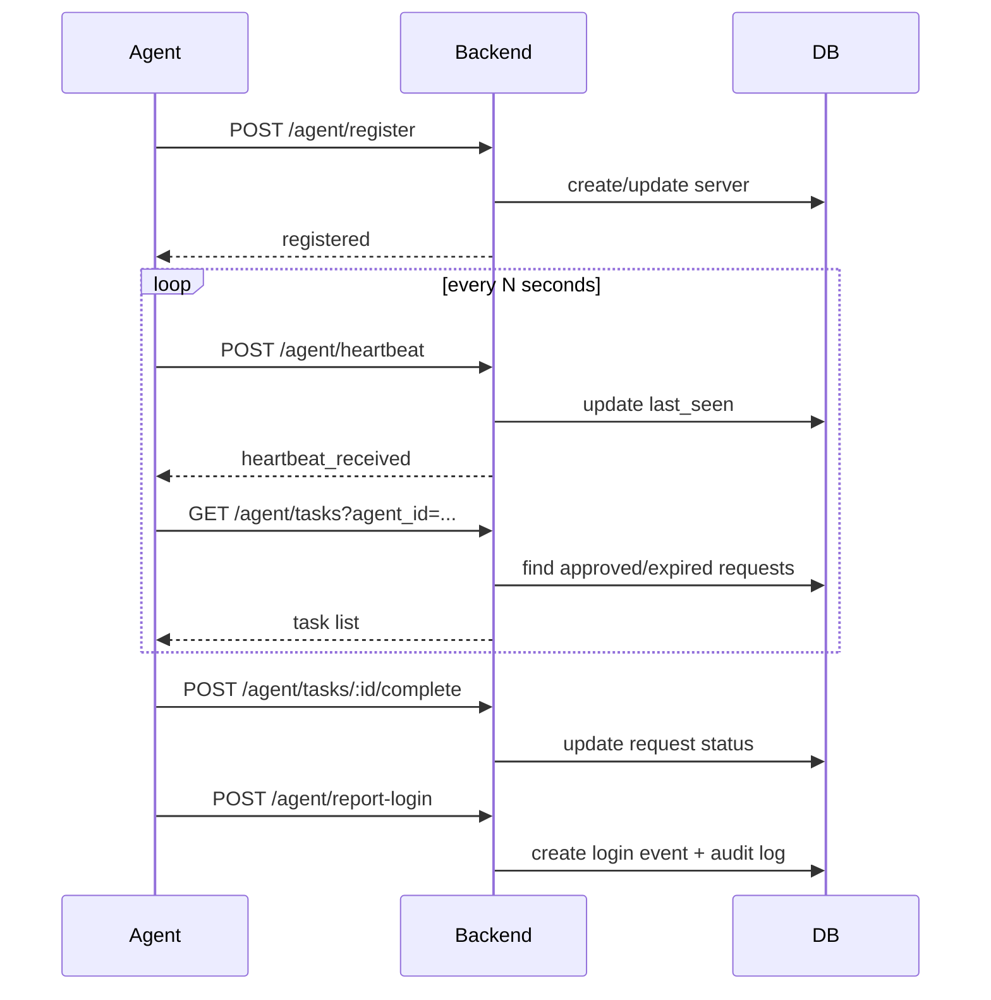
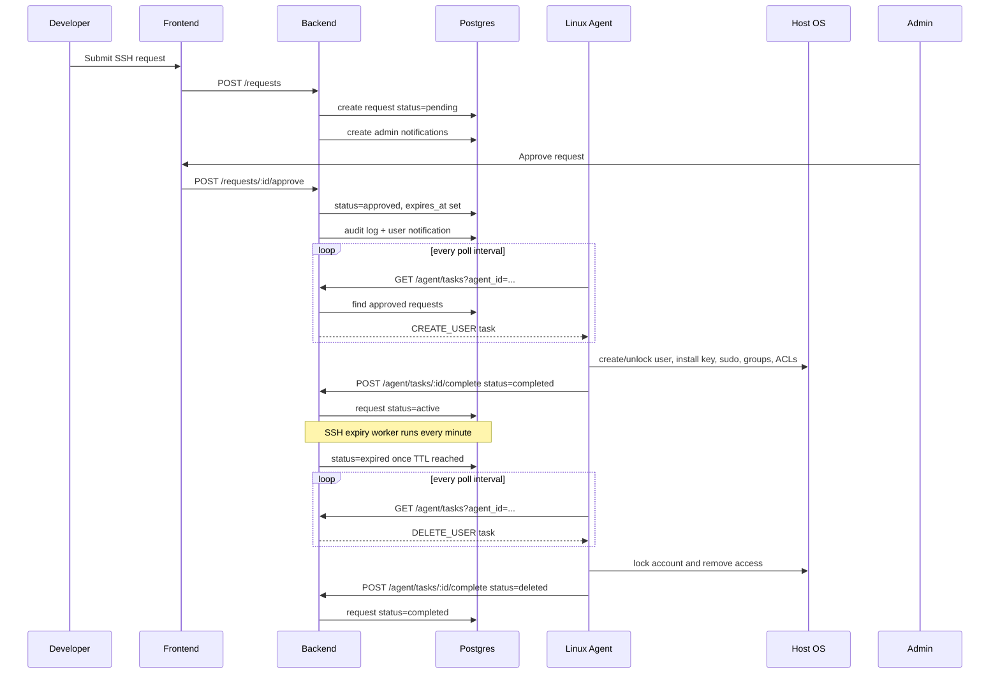

# JIT SSH System: Deep System and API Documentation

## 1. Purpose

This document explains how the full project works today, based on the current codebase.

It covers:

- overall architecture
- backend startup and runtime behavior
- database models and state transitions
- every backend API group
- which client uses each API
- SSH agent lifecycle
- cloud access lifecycle
- MCP server behavior
- important implementation notes and current gaps

This is a code-driven document, not just a design-intent document. Where current implementation differs from the original architecture vision, this document describes the current behavior.

---

## 2. High-Level Architecture

The project is made of 4 main runtime components:

1. `frontend`
   - Next.js app used by developers, approvers, and admins
   - Calls backend REST APIs directly from the browser

2. `backend`
   - Go control plane built with Gin + GORM
   - Stores state in PostgreSQL
   - Handles SSH request workflow, cloud workflow, agent APIs, token management, notifications, and audit events

3. `agent`
   - Go binary installed on target Linux servers
   - Registers with backend, sends heartbeats, polls for tasks, creates/locks local OS users, reports logins

4. `mcp-server`
   - Go MCP server that exposes high-level access-management tools for AI/tool clients
   - Translates tool calls into backend API calls

### High-Level Flow



---

## 3. Repository Layout

### Main folders

- `jit-ssh-system/backend`
  - Go API server and background workers
- `jit-ssh-system/agent`
  - Go Linux agent
- `jit-ssh-system/mcp-server`
  - Go MCP integration server
- `jit-ssh-system/frontend`
  - Next.js frontend
- `design_doc.md`
  - original SSH system design
- `aws_pam.md`
  - cloud/PAM design notes
- `jit-ssh-system/advanced_architecture_spec.md`
  - intended future large-scale architecture

---

## 4. Backend Startup and Runtime

Backend entry point: `backend/main.go`

### On startup, backend does the following

1. Initializes PostgreSQL connection using environment variables in `db/database.go`
2. Runs GORM `AutoMigrate` for all registered models
3. Seeds the database with:
   - a default team
   - a default admin user if no users exist
4. Starts two background workers:
   - SSH expiry worker
   - cloud expiry worker
5. Starts Gin HTTP server
6. Enables permissive CORS for all origins

### Default DB environment values

If environment variables are not set, backend uses:

- `DB_HOST=localhost`
- `DB_USER=jit_admin`
- `DB_PASSWORD=jit_password`
- `DB_NAME=jit_db`
- `DB_PORT=5432`

### Default bootstrap admin

If there are no users in the DB, backend seeds:

- email: `admin@jit.local`
- password: `admin-password`

### Background workers

#### SSH expiry worker

File: `backend/jobs/ssh_expiry.go`

Behavior:

- runs every minute
- finds SSH requests with:
  - `status in ('active', 'approved')`
  - `expires_at <= now`
- changes those requests to `expired`
- agent will later consume them as `DELETE_USER` tasks

#### Cloud expiry worker

File: `backend/jobs/cloud_expiry.go`

Behavior:

- runs every minute
- finds cloud requests with:
  - `status = 'active'`
  - `expires_at <= now`
- instantiates provider adapter
- revokes access directly in cloud provider
- updates status:
  - `expired` on success
  - `failed` on revoke failure

---

## 5. Data Model Overview

Primary models live in:

- `backend/models/models.go`
- `backend/models/cloud.go`
- `backend/models/settings.go`

### Core entities

#### Team

Represents organizational ownership scope.

Used for:

- grouping users
- assigning servers
- restricting approver actions by team

#### User

Represents a human platform user.

Important fields:

- `id`
- `name`
- `email`
- `role`
  - `admin`
  - `approver`
  - `developer`
- `status`
  - `active`
  - `inactive`
- `password_hash`
- `team_id`

#### Server

Represents a Linux host managed by the JIT agent.

Important fields:

- `id`
- `hostname`
- `ip`
- `instance_id`
- `agent_id`
- `status`
- `last_seen`
- `team_id`

#### ServerTag

Key-value tags attached to servers on registration.

#### AccessRequest

Represents a temporary SSH access request.

Important fields:

- `user_id`
- `server_id`
- `pub_key`
- `sudo`
- `duration`
- `status`
- `requested_path`
- `requested_services`
- `approved_by`
- `expires_at`

SSH request statuses used in code:

- `pending`
- `approved`
- `active`
- `expired`
- `completed`
- `rejected`

#### AuditLog

Stores major actions, approvals, revocations, and login visibility events.

#### LoginEvent

Represents agent-reported logins.

#### Notification

Stores user notifications shown in the frontend tray.

#### AgentToken

Represents a bearer token used by an agent to authenticate to `/api/v1/agent/*`.

#### CloudIntegration

Represents a configured cloud provider connection.

Important fields:

- `id`
- `name`
- `provider`
- `encrypted_credentials`
- `metadata`
- `status`

#### CloudAccessRequest

Represents a temporary cloud access grant request.

Important fields:

- `user_id`
- `integration_id`
- `target_group_id`
- `target_group_name`
- `duration_hours`
- `reason`
- `requires_password`
- `requires_keys`
- `status`
- `approved_at`
- `expires_at`
- `console_url`
- generated temporary credentials

Cloud request statuses used in code:

- `pending`
- `active`
- `revoked`
- `expired`
- `failed`

#### ProtectedUser

Represents usernames that should be protected from lock/delete.

Important note:

- backend stores these in DB
- agent currently uses only a hardcoded in-memory map, not the DB table

---

## 6. Current Authentication Model

### Human/API auth

Current implementation is lightweight and mostly client-driven:

- login API validates email + password
- frontend stores returned identity in browser cookies:
  - `jit_auth_role`
  - `jit_auth_name`
  - `jit_auth_id`
  - `jit_auth_email`

The backend currently does not issue JWTs or sessions for normal users.

### Agent auth

Agent routes use bearer token authentication:

- `Authorization: Bearer <agent_token>`

Middleware:

- validates token exists in `agent_tokens`
- updates `last_used_at`
- stores token metadata in Gin context

### Important implementation note

Most non-agent routes are currently exposed without server-side auth middleware. This document describes route behavior as implemented, not as ideally secured.

---

## 7. API Surface Summary

All backend APIs are mounted under:

- `/api/v1`

Groups:

1. agent API
2. agent deployment API
3. agent token management
4. SSH/dashboard APIs
5. auth APIs
6. user management APIs
7. team management APIs
8. cloud integration APIs
9. cloud request APIs
10. protected user APIs
11. health endpoint

---

## 8. Health Endpoint

### `GET /health`

Purpose:

- liveness check

Response:

```json
{
  "status": "ok"
}
```

Used by:

- operators
- health checks
- container runtime checks

---

## 9. Agent API

Base path:

- `/api/v1/agent`

These are called by the installed server agent.

### 9.1 `POST /api/v1/agent/register`

Purpose:

- agent creates or updates a server record in control plane

Called by:

- `agent/main.go` during startup

Request body:

```json
{
  "hostname": "worker-1",
  "private_ip": "10.0.0.12",
  "agent_id": "jit-agent-abc123",
  "instance_id": "i-123456",
  "region": "ap-south-1",
  "os": "linux",
  "tags": {
    "env": "prod",
    "role": "db"
  }
}
```

Behavior:

- validates request body
- transforms `tags` map into `ServerTag` records
- looks up server by `agent_id`
- creates new server if not found
- updates existing server if found
- sets:
  - `status = online`
  - `last_seen = now`
- links the `AgentToken.server_id` if token context exists

Response:

```json
{
  "status": "registered",
  "server_id": "uuid"
}
```

### 9.2 `POST /api/v1/agent/heartbeat`

Purpose:

- marks an agent/server as online and updates `last_seen`

Called by:

- agent heartbeat goroutine

Request body:

```json
{
  "agent_id": "jit-agent-abc123",
  "hostname": "worker-1",
  "uptime": 123456
}
```

Behavior:

- finds server by `agent_id`
- updates:
  - `last_seen`
  - `status = online`

Response:

```json
{
  "status": "heartbeat_received"
}
```

### 9.3 `GET /api/v1/agent/tasks?agent_id=<id>`

Purpose:

- agent fetches pending work

Called by:

- agent poll loop every `poll_interval`

Behavior:

- finds server by `agent_id`
- loads SSH access requests for that server where:
  - `status in ('approved', 'expired')`
- maps them into task records

Task mapping:

- `approved` -> `CREATE_USER`
- `expired` -> `DELETE_USER`

Task response object:

```json
{
  "task_id": "request-id",
  "task_type": "CREATE_USER",
  "username": "sanitized_username",
  "pubkey": "ssh-ed25519 AAAA...",
  "sudo": true,
  "path": "/var/log/nginx",
  "services": "docker,mysql",
  "expires_at": "2026-03-15T12:00:00Z"
}
```

Response:

- JSON array of tasks

### 9.4 `POST /api/v1/agent/tasks/:id/complete`

Purpose:

- agent reports task execution result

Called by:

- agent after local user operation completes or fails

Request body:

```json
{
  "agent_id": "jit-agent-abc123",
  "status": "completed"
}
```

Accepted statuses in current code:

- `completed`
- `deleted`
- `failed`

Behavior:

- loads `AccessRequest` by task/request id
- checks server matches supplied `agent_id`
- updates request state:
  - `completed` -> `active`
  - `deleted` -> `completed`
  - `failed`
    - if request was active, move to `expired`
    - else move to `approved`

This means failed create tasks are retried as create, and failed delete tasks are retried as delete.

Response:

```json
{
  "status": "task_updated"
}
```

### 9.5 `POST /api/v1/agent/report-login`

Purpose:

- agent reports detected SSH login events

Called by:

- login monitor in agent

Request body:

```json
{
  "agent_id": "jit-agent-abc123",
  "username": "alice_sre",
  "remote_ip": "10.2.3.4",
  "type": "login",
  "timestamp": "2026-03-15T09:12:13Z"
}
```

Behavior:

- finds server by `agent_id`
- attempts to identify user by matching `sanitizeUsername(email)` against reported `username`
- inserts a `LoginEvent`
- also inserts an `AuditLog`

Response:

```json
{
  "status": "reported"
}
```

### Agent API Call Flow



---

## 10. Agent Deployment API

These APIs support installing and updating the Linux agent.

### 10.1 `GET /api/v1/agent/deploy/download`

Purpose:

- returns the agent binary from backend filesystem

Backend behavior:

- serves `./bin/jit-agent`

Used by:

- install scripts
- admin UI download button
- OTA update flow

### 10.2 `GET /api/v1/agent/deploy/update`

Purpose:

- lets an already-running agent check if a newer version exists

Response:

```json
{
  "version": "1.0.3",
  "binary_url": "http://.../api/v1/agent/deploy/download"
}
```

Used by:

- hourly OTA update goroutine in agent

### 10.3 `GET /api/v1/agent/deploy/script?token_id=<id>`

Purpose:

- dynamically generates a shell install script with embedded agent token

Used by:

- admin UI token page

Behavior:

- loads `AgentToken` by id
- builds a bash script that:
  - downloads binary
  - writes `/etc/jit/jit-agent.conf`
  - creates a `systemd` service
  - enables and starts the agent

Generated config includes:

- `control_plane_url`
- `agent_token`
- `heartbeat_interval`
- `poll_interval`

---

## 11. Agent Token Management API

These are used mainly from admin UI.

### 11.1 `GET /api/v1/agent-tokens`

Purpose:

- list all agent tokens

Used by:

- admin token page

Response fields:

- `id`
- `label`
- `server_id`
- `created_at`
- `last_used_at`

Raw secret is never returned here.

### 11.2 `POST /api/v1/agent-tokens`

Purpose:

- create a new bearer token for agent installation

Request body:

```json
{
  "label": "prod-db-1"
}
```

Behavior:

- generates secure random 32-byte hex token
- stores token in DB
- returns raw token once

Response:

```json
{
  "id": "uuid",
  "label": "prod-db-1",
  "token": "raw-secret",
  "created_at": "timestamp",
  "note": "Copy this token into your agent config. It will NOT be shown again."
}
```

### 11.3 `DELETE /api/v1/agent-tokens/:id`

Purpose:

- revoke token permanently

Behavior:

- deletes token row

Used by:

- admin token page

---

## 12. SSH / Dashboard API

These APIs power the main SSH request workflow and admin dashboard.

### 12.1 `GET /api/v1/servers`

Purpose:

- list all registered servers

Used by:

- developer portal
- admin dashboard
- admin servers page
- MCP server tool `list_ssh_servers`

Behavior:

- preloads tags and team
- returns all servers
- if `last_seen` older than 30 seconds:
  - marks server `offline`
  - updates DB

Response:

- array of `Server` objects

### 12.2 `PUT /api/v1/servers/:id/team`

Purpose:

- assign or remove a server’s team ownership

Used by:

- admin servers page

Request body:

```json
{
  "team_id": "uuid-or-empty-string"
}
```

Behavior:

- updates `team_id`
- empty string clears team

### 12.3 `GET /api/v1/requests`

Purpose:

- list SSH access requests

Used by:

- developer portal
- admin dashboard
- MCP `get_access_status` tool indirectly

Behavior:

- preloads `User` and `Server`
- returns all requests

### 12.4 `POST /api/v1/requests`

Purpose:

- create a new SSH access request

Used by:

- developer frontend
- MCP tool `request_ssh_access`

Request body:

```json
{
  "server_id": "uuid",
  "user_id": "uuid",
  "pub_key": "ssh-ed25519 AAAA...",
  "duration": "1h",
  "sudo": false,
  "requested_path": "/var/log/nginx",
  "requested_services": "docker",
  "reason": "Debug production issue"
}
```

Behavior:

- creates `AccessRequest` with `status = pending`
- notifies all admin users using `Notification`

Response:

- created request object

### 12.5 `POST /api/v1/requests/:id/approve`

Purpose:

- approve a pending SSH request

Used by:

- admin dashboard

Request body:

```json
{
  "approver_id": "uuid",
  "duration": "1h"
}
```

Behavior:

- loads request
- ensures request is `pending`
- if caller is an `approver`, checks team ownership rules
- determines final duration:
  - payload override if present
  - otherwise original request duration
- parses duration
- sets:
  - `status = approved`
  - `expires_at = now + duration`
  - `duration = final duration string`
- inserts audit log
- notifies requesting user

Response:

```json
{
  "status": "approved",
  "request": { ... }
}
```

### 12.6 `POST /api/v1/requests/:id/revoke`

Purpose:

- manually revoke SSH access before natural TTL expiry

Used by:

- admin dashboard

Behavior:

- request must be `approved` or `active`
- sets:
  - `status = expired`
  - `expires_at = now`
- creates audit log
- notifies user

Agent later sees this as a `DELETE_USER` task.

### 12.7 `DELETE /api/v1/requests/:id`

Purpose:

- reject a pending SSH request

Used by:

- admin dashboard

Behavior:

- only works if request is `pending`
- sets `status = rejected`
- creates audit log
- notifies requester

### 12.8 `GET /api/v1/logs`

Purpose:

- list recent audit logs

Used by:

- admin dashboard
- admin audit page

Behavior:

- returns last 100 logs ordered by timestamp desc

### 12.9 `GET /api/v1/login-events`

Purpose:

- list recent login events

Used by:

- notification tray

Behavior:

- returns last 20 events
- preloads server and user

### 12.10 `GET /api/v1/notifications?user_id=<id>`

Purpose:

- fetch notifications for a specific user

Used by:

- notification tray

Behavior:

- requires `user_id` query param
- returns latest 20 notifications

### 12.11 `POST /api/v1/notifications/:id/read`

Purpose:

- mark single notification as read

Used by:

- notification tray

### 12.12 `DELETE /api/v1/notifications?user_id=<id>`

Purpose:

- clear all notifications for a user

Used by:

- notification tray

---

## 13. Auth API

### 13.1 `POST /api/v1/auth/login`

Purpose:

- validate email/password

Used by:

- login page
- settings page verify step

Request body:

```json
{
  "email": "user@example.com",
  "password": "secret"
}
```

Behavior:

- loads user by email
- checks password hash with bcrypt
- returns identity payload

Response:

```json
{
  "id": "uuid",
  "name": "User Name",
  "email": "user@example.com",
  "role": "developer",
  "team": { ... }
}
```

Frontend then stores the identity in cookies.

### 13.2 `POST /api/v1/auth/set-password`

Purpose:

- set password for a user

Used by:

- admin users page
- user settings page

Request body:

```json
{
  "user_id": "uuid",
  "password": "new-password"
}
```

Behavior:

- bcrypt-hashes new password
- updates `password_hash`

### 13.3 `POST /api/v1/auth/reset-password/:id`

Purpose:

- reset a user’s password to a random temporary password

Used by:

- admin users page

Behavior:

- generates random password
- bcrypt-hashes it
- updates DB
- returns plaintext password one time

Response:

```json
{
  "temp_password": "generated-password"
}
```

---

## 14. User Management API

### 14.1 `GET /api/v1/users`

Purpose:

- list all users

Used by:

- admin users page
- admin servers page

Behavior:

- preloads team
- orders by creation desc

### 14.2 `POST /api/v1/users`

Purpose:

- create new human user

Used by:

- admin users page

Request body:

```json
{
  "name": "Alice",
  "email": "alice@example.com",
  "role": "developer",
  "team_id": "optional-uuid"
}
```

Behavior:

- creates user
- generates one-time random password
- hashes password
- returns user and plaintext temp password

### 14.3 `PUT /api/v1/users/:id/role`

Purpose:

- generic update endpoint for user role, team, and name

Used by:

- admin users page

Possible request bodies:

```json
{ "role": "approver" }
```

```json
{ "team_id": "uuid" }
```

```json
{ "name": "New Name" }
```

Behavior:

- updates any subset of:
  - `role`
  - `name`
  - `team_id`

### 14.4 `DELETE /api/v1/users/:id`

Purpose:

- permanently delete user

Used by:

- admin users page

### 14.5 `PUT /api/v1/users/:id/status`

Purpose:

- toggle user between `active` and `inactive`

Used by:

- admin users page

Response:

```json
{
  "status": "inactive"
}
```

---

## 15. Team Management API

### 15.1 `GET /api/v1/teams`

Purpose:

- list all teams

Used by:

- admin users page
- admin servers page
- admin teams page

### 15.2 `POST /api/v1/teams`

Purpose:

- create team

Used by:

- admin teams page

Request body:

```json
{
  "name": "Platform",
  "description": "Platform engineering team"
}
```

### 15.3 `PUT /api/v1/teams/:id`

Purpose:

- update team name or description

Used by:

- admin teams page

---

## 16. Cloud Integration API

These APIs configure provider connectivity and fetch provider groups.

### 16.1 `GET /api/v1/cloud-integrations`

Purpose:

- list configured cloud integrations

Used by:

- admin cloud page
- user cloud page
- MCP tool `list_cloud_integrations`

Behavior:

- returns integrations without raw credentials

### 16.2 `POST /api/v1/cloud-integrations`

Purpose:

- create cloud integration

Used by:

- admin cloud page

Request body:

```json
{
  "name": "AWS Prod",
  "provider": "aws",
  "credentials": "{\"access_key_id\":\"...\",\"secret_access_key\":\"...\"}",
  "metadata": "{\"region\":\"ap-south-1\",\"identity_store_id\":\"...\",\"sso_start_url\":\"...\"}"
}
```

Behavior:

- gets encryption master key
- encrypts `credentials`
- stores encrypted credentials and metadata
- marks status `active`

### 16.3 `PUT /api/v1/cloud-integrations/:id`

Purpose:

- update integration metadata and optionally credentials

Used by:

- admin cloud page edit flow

Behavior:

- updates `name`
- updates `metadata`
- if credentials supplied:
  - re-encrypts them

### 16.4 `DELETE /api/v1/cloud-integrations/:id`

Purpose:

- delete integration

Used by:

- admin cloud page

Note:

- model supports soft delete via `DeletedAt`
- controller uses GORM `Delete`, so deletion is soft delete behavior

### 16.5 `POST /api/v1/cloud-integrations/:id/test`

Purpose:

- validate connectivity using stored credentials

Used by:

- admin cloud page

Behavior:

- instantiates provider adapter
- calls `TestConnection`
- marks integration:
  - `active` on success
  - `error` on failure

### 16.6 `GET /api/v1/cloud-integrations/:id/groups`

Purpose:

- fetch available groups from provider

Used by:

- user cloud request page
- admin cloud approval modal
- MCP tool `list_cloud_groups`

Behavior:

- instantiates provider
- calls `ListGroups`

Current provider support:

- AWS Identity Center: implemented
- AWS IAM: implemented
- GCP: stub returns empty list
- Azure: stub returns empty list

---

## 17. Cloud Request API

These APIs power the just-in-time cloud access workflow.

### 17.1 `GET /api/v1/cloud-requests`

Purpose:

- list all cloud access requests

Used by:

- admin cloud page
- user cloud page
- MCP status lookup

Behavior:

- preloads user and integration

### 17.2 `POST /api/v1/cloud-requests`

Purpose:

- create a cloud access request

Used by:

- user cloud page
- MCP tool `request_cloud_access`

Request body:

```json
{
  "user_id": "uuid",
  "integration_id": "uuid",
  "target_group_id": "group-id",
  "target_group_name": "ProdAdmin",
  "duration_hours": 4,
  "reason": "Production debugging",
  "requires_password": true,
  "requires_keys": false
}
```

Behavior:

- stores request with `status = pending`

### 17.3 `POST /api/v1/cloud-requests/:id/approve`

Purpose:

- approve and grant cloud access

Used by:

- admin cloud page

Optional request body:

```json
{
  "target_group_id": "override-group-id",
  "target_group_name": "override-name"
}
```

Behavior:

1. load cloud request, user, integration
2. ensure request is `pending`
3. optionally override group target
4. instantiate provider using integration type
5. call `GrantAccess`
6. set:
   - `status = active`
   - `approved_at = now`
   - `expires_at = now + duration_hours`
7. persist any temporary credentials returned by provider

Possible returned fields after approval:

- `console_url`
- `temp_password`
- `temp_access_key`
- `temp_secret_key`

### 17.4 `POST /api/v1/cloud-requests/:id/revoke`

Purpose:

- manually revoke active cloud grant

Used by:

- admin cloud page

Behavior:

- request must be `active`
- provider `RevokeAccess` is called
- request status becomes `revoked`

### 17.5 `DELETE /api/v1/cloud-requests/:id`

Purpose:

- delete/reject pending cloud request

Used by:

- admin cloud page
- user cloud page cancel flow

Behavior:

- only works if request is still `pending`

---

## 18. Protected User API

These APIs are intended to manage usernames that should never be locked or deleted by JIT automation.

Important current implementation note:

- backend stores these in DB
- agent enforcement currently only checks hardcoded usernames in code

### 18.1 `GET /api/v1/protected-users`

Purpose:

- list protected usernames

### 18.2 `POST /api/v1/protected-users`

Purpose:

- add protected username

Request body:

```json
{
  "username": "ubuntu",
  "reason": "Base OS account"
}
```

### 18.3 `DELETE /api/v1/protected-users/:id`

Purpose:

- remove protected username record

---

## 19. Frontend to API Usage Map

This section explains which frontend page uses which backend API.

### Login page

File:

- `frontend/src/app/login/page.tsx`

Calls:

- `POST /auth/login`

Then stores cookies:

- `jit_auth_role`
- `jit_auth_name`
- `jit_auth_id`
- `jit_auth_email`

### Developer SSH page

File:

- `frontend/src/app/page.tsx`

Calls:

- `GET /servers`
- `GET /requests`
- `POST /requests`

Purpose:

- request SSH access
- track own SSH requests

### Admin dashboard

File:

- `frontend/src/app/admin/page.tsx`

Calls:

- `GET /servers`
- `GET /requests`
- `GET /logs`
- `POST /requests/:id/approve`
- `POST /requests/:id/revoke`
- `DELETE /requests/:id`

### Notification tray

File:

- `frontend/src/components/NotificationTray.tsx`

Calls:

- `GET /notifications?user_id=...`
- `GET /login-events`
- `POST /notifications/:id/read`
- `DELETE /notifications?user_id=...`

### Admin users page

File:

- `frontend/src/app/admin/users/page.tsx`

Calls:

- `GET /users`
- `GET /teams`
- `PUT /users/:id/role`
- `POST /users`
- `POST /auth/set-password`
- `POST /auth/reset-password/:id`
- `DELETE /users/:id`
- `PUT /users/:id/status`

### Admin servers page

File:

- `frontend/src/app/admin/servers/page.tsx`

Calls:

- `GET /servers`
- `GET /teams`
- `GET /users`
- `PUT /servers/:id/team`

### Admin teams page

File:

- `frontend/src/app/admin/teams/page.tsx`

Calls:

- `GET /teams`
- `POST /teams`
- `PUT /teams/:id`

### Admin tokens page

File:

- `frontend/src/app/admin/tokens/page.tsx`

Calls:

- `GET /agent-tokens`
- `POST /agent-tokens`
- `DELETE /agent-tokens/:id`
- `GET /agent/deploy/script?token_id=...`
- `GET /agent/deploy/download`

### Admin audit page

File:

- `frontend/src/app/admin/audit/page.tsx`

Calls:

- `GET /logs`

### User cloud page

File:

- `frontend/src/app/cloud/page.tsx`

Calls:

- `GET /cloud-integrations`
- `GET /cloud-requests`
- `GET /cloud-integrations/:id/groups`
- `POST /cloud-requests`
- `DELETE /cloud-requests/:id`

### Admin cloud page

File:

- `frontend/src/app/admin/cloud/page.tsx`

Calls:

- `GET /cloud-integrations`
- `GET /cloud-requests`
- `POST /cloud-integrations`
- `PUT /cloud-integrations/:id`
- `DELETE /cloud-integrations/:id`
- `POST /cloud-integrations/:id/test`
- `GET /cloud-integrations/:id/groups`
- `POST /cloud-requests/:id/approve`
- `POST /cloud-requests/:id/revoke`
- `DELETE /cloud-requests/:id`

---

## 20. MCP Server API Usage

MCP entry point:

- `mcp-server/main.go`

The MCP server exposes simplified tools to outside AI/tool clients and translates them into backend API calls.

### MCP tool: `list_ssh_servers`

Calls:

- `GET /servers`

### MCP tool: `request_ssh_access`

Calls:

- `POST /requests`

Payload mapping:

- `duration_hours` -> backend `duration` string like `"4h"`
- `JIT_USER_ID` env var becomes `user_id`

### MCP tool: `list_cloud_integrations`

Calls:

- `GET /cloud-integrations`

### MCP tool: `list_cloud_groups`

Calls:

- `GET /cloud-integrations/:id/groups`

### MCP tool: `request_cloud_access`

Calls:

- `POST /cloud-requests`

### MCP tool: `get_access_status`

Calls:

- `GET /requests` or `GET /cloud-requests`

Then:

- scans all returned requests in-process
- finds one matching provided `request_id`

---

## 21. Agent Runtime Behavior

Agent entry point:

- `agent/main.go`

Config loader:

- `agent/config.go`

System executor:

- `agent/system.go`

### Agent startup sequence

1. read config file or env vars
2. auto-generate `agent_id` if missing
3. determine hostname and private IP
4. create `SystemHandler`
5. register with backend
6. start goroutines:
   - heartbeat loop
   - task polling loop
   - login monitor
   - OTA update checker
7. block forever

### Config fields

- `control_plane_url`
- `agent_id`
- `agent_token`
- `heartbeat_interval_sec`
- `poll_interval_sec`
- `log_file`
- `tags`

### Agent local actions for `CREATE_USER`

When `CREATE_USER` task is received:

1. check if Linux user exists
2. if not:
   - `useradd -m -s /bin/bash <username>`
3. if yes:
   - unlock user with `usermod -U -s /bin/bash`
4. create `/home/<user>/.ssh`
5. write `authorized_keys`
6. `chown` SSH directory
7. if `sudo = true`
   - write `/etc/sudoers.d/<username>`
8. if services requested
   - `usermod -aG <group>`
9. if path requested
   - `setfacl -R -m u:<user>:rx <path>`
10. report completion to backend

### Agent local actions for `DELETE_USER`

When `DELETE_USER` task is received:

1. check if username is hardcoded protected user
2. if protected:
   - skip OS deletion
   - still report `deleted`
3. otherwise:
   - `pkill -KILL -u <username>`
   - `usermod -L -s /usr/sbin/nologin`
   - replace `authorized_keys`
   - remove sudoers file
   - report `deleted`

Important:

- implementation locks user instead of deleting home directory
- data is intentionally preserved

### Login monitor

Agent periodically runs:

- `last -F -n 10`

It parses recent login lines and sends them to:

- `POST /agent/report-login`

### OTA update behavior

Agent checks hourly:

- `GET /agent/deploy/update`

If version differs:

1. downloads new binary from `binary_url`
2. replaces current executable atomically
3. exits
4. relies on `systemd` restart

---

## 22. SSH Request Lifecycle



---

## 23. Cloud Request Lifecycle

Cloud access differs from SSH access because the backend itself performs the grant and revoke operations.

```mermaid
C
```

---

## 24. Cloud Provider Adapter Behavior

Factory:

- `backend/pkg/cloud/factory.go`

The backend chooses provider implementation using `CloudIntegration.provider`.

### Supported provider values

- `aws`
  - AWS Identity Center / Identity Store flow
- `aws-iam`
  - legacy IAM user/group flow
- `gcp`
  - Cloud Identity group membership flow
- `azure`
  - Microsoft Graph / Entra ID group membership flow

### AWS Identity Center adapter

File:

- `pkg/cloud/aws_adapter.go`

Behavior:

- decrypt static access key credentials
- connect to AWS Identity Store
- resolve user by email
- auto-create user if missing
- add/remove group membership
- list groups
- test connection

### AWS IAM adapter

File:

- `pkg/cloud/aws_iam_adapter.go`

Behavior:

- resolve IAM user by email-derived username
- auto-create IAM user if missing
- add/remove from IAM group
- optionally create:
  - console password
  - access keys
- revoke by:
  - removing group membership
  - deleting access keys
  - deleting login profile

### GCP adapter

File:

- `pkg/cloud/gcp_adapter.go`

Behavior:

- uses Cloud Identity API
- grants by creating group membership
- revokes by deleting membership
- `ListGroups` is currently stubbed and returns empty list

### Azure adapter

File:

- `pkg/cloud/azure_adapter.go`

Behavior:

- uses Microsoft Graph API
- resolves user in Entra ID
- adds/removes group membership
- `ListGroups` is currently stubbed and returns empty list

---

## 25. Notifications and Audit Behavior

### Notifications are created for

- new SSH request -> notify admins
- SSH request approved -> notify requesting user
- SSH request rejected -> notify requesting user
- SSH request revoked -> notify requesting user

### Audit logs are created for

- SSH request approval
- SSH request rejection
- SSH request revocation
- login report events

### Current cloud request audit behavior

Cloud request controllers currently do not create audit log or notification records in the same way SSH request controllers do.

---

## 26. Current State Transitions

### SSH request state machine

```text
pending
  -> approved
  -> rejected

approved
  -> active        (agent completed create)
  -> expired       (manual revoke or TTL worker)
  -> approved      (retry after create failure)

active
  -> expired       (TTL worker or manual revoke)

expired
  -> completed     (agent completed delete)
  -> expired       (retry delete path)
```

### Cloud request state machine

```text
pending
  -> active        (approve + provider grant success)
  -> deleted       (reject/delete route behavior is DB delete, not status change)

active
  -> revoked       (manual revoke)
  -> expired       (expiry worker revoke success)
  -> failed        (expiry worker revoke failure)
```

---

## 27. Known Implementation Gaps and Important Notes

This section documents current realities of the code so future readers do not confuse intent with implementation.

### 27.1 Backend build issue

`backend/controllers/settings_controller.go` currently begins with a markdown fence:

- `````package controllers`

This breaks backend compilation until fixed.

### 27.2 Human auth is frontend-cookie based

Current login flow:

- backend returns user object
- frontend writes cookies itself

There is no current backend-issued session or JWT model for normal users.

### 27.3 Most non-agent routes are not server-side protected

The control plane currently mounts many routes without role middleware.

### 27.4 Protected user DB table is not enforced by agent

Backend supports CRUD for `ProtectedUser`, but agent checks only:

- `root`
- `ubuntu`
- `ec2-user`
- `admin`

from a hardcoded map.

### 27.5 GCP and Azure group listing are incomplete

`ListGroups()` for:

- GCP
- Azure

currently returns empty arrays.

### 27.6 Agent tasking uses request table directly

There is no separate `tasks` table yet.

Current task dispatching is derived from SSH request status:

- `approved` means create task
- `expired` means delete task

### 27.7 Username mapping is lossy

Linux username is derived from sanitized email prefix, which can collide across different users.

### 27.8 Agent does lock, not full delete

Despite task type name `DELETE_USER`, current behavior is:

- lock account
- set shell to nologin
- clear keys
- remove sudoers

It preserves home data.

---

## 28. End-to-End Component Responsibilities

### Frontend responsibilities

- collect request data
- display approval queues and status
- render notifications and recent activity
- store temporary browser identity cookies
- trigger all admin actions from browser

### Backend responsibilities

- persist all state
- orchestrate SSH approval flow
- transform request state into agent tasks
- execute cloud grants and revokes directly
- manage users, teams, integrations, tokens
- generate notifications and audit logs
- expose install/update endpoints for agent

### Agent responsibilities

- discover local metadata
- authenticate with backend
- maintain presence via heartbeat
- poll tasks
- apply Linux account changes
- detect and report logins
- self-update

### MCP server responsibilities

- expose simplified tools
- map tool input to backend API payloads
- act as AI-friendly control-plane adapter

---

## 29. Suggested Future Documentation Splits

As the project grows, this document should likely be split into:

1. `ARCHITECTURE.md`
2. `BACKEND_API.md`
3. `AGENT_RUNTIME.md`
4. `CLOUD_ACCESS.md`
5. `MCP_INTEGRATION.md`
6. `SECURITY_MODEL.md`

For now, this file is intentionally comprehensive so a new engineer can understand the whole system from one place.

---

## 30. Quick Index of All Current Backend Routes

```text
GET    /health

POST   /api/v1/agent/register
POST   /api/v1/agent/heartbeat
GET    /api/v1/agent/tasks
POST   /api/v1/agent/tasks/:id/complete
POST   /api/v1/agent/report-login

GET    /api/v1/agent/deploy/download
GET    /api/v1/agent/deploy/update
GET    /api/v1/agent/deploy/script

GET    /api/v1/agent-tokens
POST   /api/v1/agent-tokens
DELETE /api/v1/agent-tokens/:id

GET    /api/v1/servers
PUT    /api/v1/servers/:id/team
GET    /api/v1/requests
POST   /api/v1/requests
POST   /api/v1/requests/:id/approve
POST   /api/v1/requests/:id/revoke
DELETE /api/v1/requests/:id
GET    /api/v1/logs
GET    /api/v1/login-events
GET    /api/v1/notifications
POST   /api/v1/notifications/:id/read
DELETE /api/v1/notifications

GET    /api/v1/users
POST   /api/v1/users
PUT    /api/v1/users/:id/role
DELETE /api/v1/users/:id
PUT    /api/v1/users/:id/status

POST   /api/v1/auth/login
POST   /api/v1/auth/set-password
POST   /api/v1/auth/reset-password/:id

GET    /api/v1/teams
POST   /api/v1/teams
PUT    /api/v1/teams/:id

GET    /api/v1/cloud-integrations
POST   /api/v1/cloud-integrations
POST   /api/v1/cloud-integrations/:id/test
GET    /api/v1/cloud-integrations/:id/groups
PUT    /api/v1/cloud-integrations/:id
DELETE /api/v1/cloud-integrations/:id

GET    /api/v1/cloud-requests
POST   /api/v1/cloud-requests
POST   /api/v1/cloud-requests/:id/approve
POST   /api/v1/cloud-requests/:id/revoke
DELETE /api/v1/cloud-requests/:id

GET    /api/v1/protected-users
POST   /api/v1/protected-users
DELETE /api/v1/protected-users/:id
```

