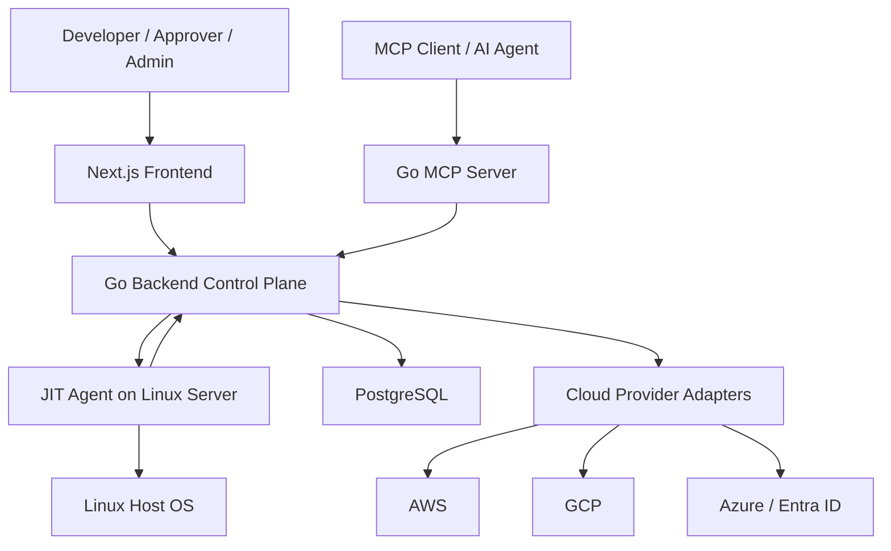
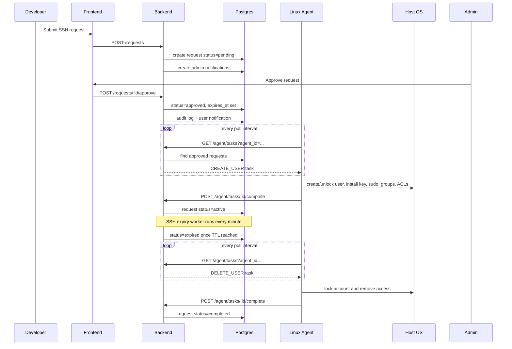
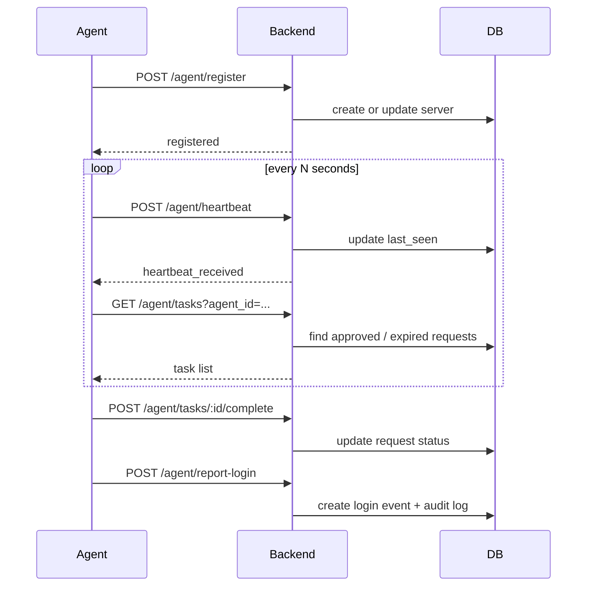
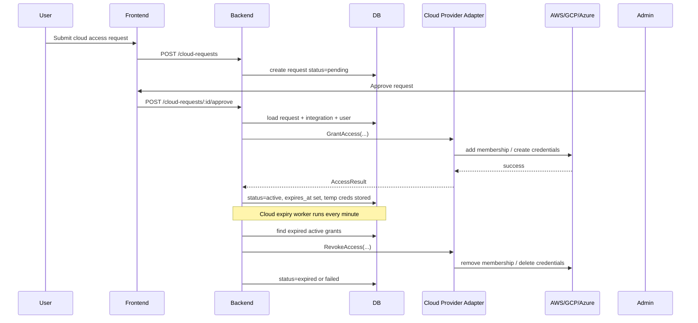

# JIT SSH System

Just-in-time infrastructure access platform for:

- temporary SSH access on Linux servers through a lightweight agent
- temporary cloud access for AWS, GCP, and Azure / Entra ID
- approval workflows for developers, approvers, and admins
- audit visibility, notifications, and optional MCP integration for AI/tool clients

This repository contains:

- a Go backend control plane
- a Next.js frontend
- a Go Linux agent
- a Go MCP server

For a code-level deep dive, see [DEEP_SYSTEM_AND_API_DOCUMENTATION.md](./DEEP_SYSTEM_AND_API_DOCUMENTATION.md).

---

## Architecture

The project has four main moving parts:

1. `frontend`
   - browser UI for developers, approvers, and admins
2. `backend`
   - central control plane, REST API, background workers, and audit layer
3. `agent`
   - Linux server agent that creates and revokes local SSH access
4. `mcp-server`
   - MCP interface for AI agents and tool clients

### System Overview



---

## Main Flows

### SSH Access Lifecycle



### Agent Registration, Heartbeat, and Task Polling



### Cloud Access Lifecycle



---

## Repository Layout

```text
jit-ssh-system/
├── agent/         # Go Linux agent
├── backend/       # Go backend control plane
├── frontend/      # Next.js web UI
├── mcp-server/    # Go MCP bridge
├── docker-compose.yml
├── README.md
└── DEEP_SYSTEM_AND_API_DOCUMENTATION.md
```

---

## Quick Start With Docker

This is the fastest way for a new developer to run the system locally.

### Prerequisites

- Docker
- Docker Compose

### 1. Start the stack

From the `jit-ssh-system` directory:

```bash
docker compose up --build
```

This starts:

- PostgreSQL on `localhost:5432`
- backend on `http://localhost:8080`
- frontend on `http://localhost:3000`

### 2. Open the UI

- Frontend: [http://localhost:3000](http://localhost:3000)
- Backend health: [http://localhost:8080/health](http://localhost:8080/health)

### 3. Log in with the bootstrap admin

If the database is empty, backend seeds:

- email: `admin@jit.local`
- password: `admin-password`

Change this immediately after login.

### 4. Create your first agent token

From the admin UI:

- go to `Agent Tokens`
- create a token
- keep the revealed token safe

### 5. Deploy an agent on a Linux host

Use the generated install script or manual install steps documented below.

---

## Docker Compose Details

Current `docker-compose.yml` starts three services:

### `db`

- image: `postgres:15-alpine`
- user: `jit_admin`
- password: `jit_password`
- database: `jit_db`

### `backend`

Key environment variables:

- `DB_HOST=db`
- `DB_USER=jit_admin`
- `DB_PASSWORD=jit_password`
- `DB_NAME=jit_db`
- `DB_PORT=5432`
- `PORT=8080`
- `JIT_MASTER_KEY=<base64 key>`

### `frontend`

Key environment variable:

- `NEXT_PUBLIC_API_URL=http://localhost:8080/api/v1`

---

## Manual Local Development

If you prefer running services individually:

### 1. Start PostgreSQL

Create a local PostgreSQL database with:

- database: `jit_db`
- user: `jit_admin`
- password: `jit_password`

### 2. Run backend

```bash
cd backend
export DB_HOST=localhost
export DB_USER=jit_admin
export DB_PASSWORD=jit_password
export DB_NAME=jit_db
export DB_PORT=5432
export PORT=8080
export JIT_MASTER_KEY="$(openssl rand -base64 32)"
export JIT_SESSION_SECRET="change-this-in-your-env"
go run main.go
```

### 3. Run frontend

```bash
cd frontend
export NEXT_PUBLIC_API_URL=http://localhost:8080/api/v1
npm ci
npm run dev
```

### 4. Optional: run MCP server

```bash
cd mcp-server
export JIT_API_URL=http://localhost:8080/api/v1
export JIT_USER_ID=<some-existing-user-id>
go run main.go
```

---

## Environment Variables

### Backend

Required or strongly recommended:

- `DB_HOST`
- `DB_USER`
- `DB_PASSWORD`
- `DB_NAME`
- `DB_PORT`
- `PORT`
- `JIT_MASTER_KEY`
- `JIT_SESSION_SECRET`

### Frontend

- `NEXT_PUBLIC_API_URL`

### MCP Server

- `JIT_API_URL`
- `JIT_USER_ID`

### Agent

Configured in file or environment:

- `control_plane_url`
- `agent_token`
- `agent_id`
- `heartbeat_interval_sec`
- `poll_interval_sec`
- `tags`

---

## How To Deploy an Agent on a New Linux Server

You have two good options.

### Option A: Use the generated deployment script

1. Open the admin UI
2. Go to `Agent Tokens`
3. Create a token
4. Use the generated deployment script URL:

```text
GET /api/v1/agent/deploy/script?token_id=<token-id>
```

5. Run that script on the Linux machine as `root`

This method:

- downloads the binary
- writes agent config
- creates a `systemd` unit
- starts the service

### Option B: Use `agent/install.sh`

On the target Linux host:

```bash
chmod +x install.sh
sudo ./install.sh \
  --control-plane http://YOUR_BACKEND_IP:8080/api/v1 \
  --token YOUR_AGENT_TOKEN \
  --tags environment=production,team=devops
```

Optional flags:

- `--heartbeat-interval`
- `--poll-interval`
- `--binary-url`

### Agent Config File

Typical generated config:

```ini
control_plane_url = http://YOUR_BACKEND_IP:8080/api/v1
agent_token = YOUR_AGENT_TOKEN
agent_id =
heartbeat_interval_sec = 30
poll_interval_sec = 15
log_file = /var/log/jit-agent.log
tags = environment=production,team=devops
```

The agent auto-generates `agent_id` on first run if it is blank.

### Verify the agent

On the Linux host:

```bash
systemctl status jit-agent
journalctl -u jit-agent -f
```

In the admin UI:

- open `Servers`
- verify the server appears as registered and online

---

## How To Use the Platform

### SSH access flow

1. Developer logs into the frontend
2. Developer submits SSH request
3. Admin or approver approves request
4. Agent picks up `CREATE_USER`
5. Developer can SSH to the target machine
6. Backend expires request at TTL
7. Agent picks up `DELETE_USER`
8. Access is removed

### Cloud access flow

1. User opens the cloud page
2. User selects integration + group + duration
3. User submits request
4. Admin or approver approves
5. Backend grants cloud access directly through provider adapter
6. Expiry worker revokes access after TTL

### MCP flow

1. MCP client connects to the Go MCP server
2. MCP server calls backend APIs such as:
   - `GET /servers`
   - `POST /requests`
   - `GET /cloud-integrations`
   - `POST /cloud-requests`
3. AI/tool client can request or check access without using the web UI

---

## First-Time Setup Checklist

For a fresh environment, a new engineer should do this:

1. Start PostgreSQL
2. Start backend with `JIT_MASTER_KEY` and `JIT_SESSION_SECRET`
3. Start frontend with `NEXT_PUBLIC_API_URL`
4. Log in as bootstrap admin
5. Change bootstrap admin password
6. Create real users and teams
7. Create at least one agent token
8. Install an agent on one Linux host
9. Verify server registration
10. Create at least one cloud integration if cloud access is needed
11. Test an SSH request end to end
12. Test a cloud request end to end

---

## Production Deployment Notes

Before deploying to a real environment, you should change these defaults:

- replace the bootstrap admin password immediately
- set a strong `JIT_MASTER_KEY`
- set a strong `JIT_SESSION_SECRET`
- move DB credentials into a proper secret manager
- run backend and frontend behind a reverse proxy / ingress
- set `NEXT_PUBLIC_API_URL` to the real public backend URL
- use TLS for frontend and backend
- restrict database network access
- keep agent tokens scoped and rotated

Recommended production shape:

- PostgreSQL as managed DB or dedicated VM
- backend behind NGINX / ALB / Ingress
- frontend behind HTTPS
- agents on private Linux servers
- cloud credentials stored securely and rotated

---

## Useful Commands

### Start local stack

```bash
docker compose up --build
```

### Stop local stack

```bash
docker compose down
```

### Backend tests

```bash
cd backend
env GOCACHE=/tmp/jit-backend-cache go test ./...
```

### Agent tests

```bash
cd agent
env GOCACHE=/tmp/jit-agent-cache go test ./...
```

### Frontend lint

```bash
cd frontend
npm run lint
```

---

## Troubleshooting

### Frontend loads but cannot log in

Check:

- backend is running on port `8080`
- `NEXT_PUBLIC_API_URL` points to the correct backend URL
- browser can reach `/api/v1/auth/login`

### Backend starts but cloud integrations fail

Check:

- `JIT_MASTER_KEY` is set
- credentials JSON is valid for the selected provider
- metadata JSON contains provider-specific required fields

### Agent never shows up

Check:

- `control_plane_url` is correct
- agent token is valid
- target host can reach backend
- `systemctl status jit-agent`
- `journalctl -u jit-agent -f`

### SSH request is approved but user cannot log in

Check:

- agent polling interval
- agent logs
- backend request status
- server registration status
- Linux permissions on `.ssh/authorized_keys`

---

## Known Current Gaps

The repo is functional, but a new engineer should know these current realities:

- frontend still has lint/type cleanup pending
- GCP and Azure `ListGroups()` are not fully implemented
- protected user enforcement is currently hardcoded in the agent
- backend stores many flows correctly, but production hardening is still ongoing

---

## Documentation Map

- High-level deploy/use guide: [README.md](./README.md)
- Deep code and API documentation: [DEEP_SYSTEM_AND_API_DOCUMENTATION.md](./DEEP_SYSTEM_AND_API_DOCUMENTATION.md)

