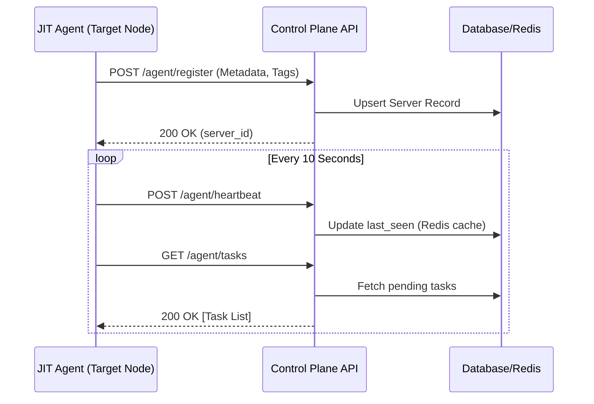
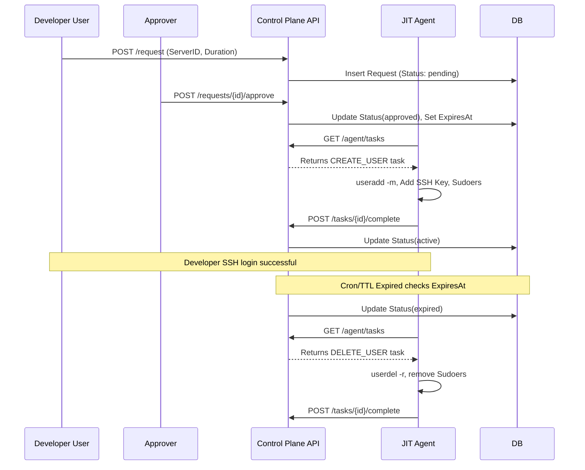

# Advanced JIT SSH Architecture & Specification

## 1. 10k Server Scalable Architecture

To support 10,000+ servers polling every 10 seconds, the Control Plane requires a highly scalable architecture to prevent database exhaustion and connection limits.

```mermaid
graph TD
    subgraph "Edge / Load Balancing"
        ALB[AWS ALB / NGINX Ingress]
    end

    subgraph "Control Plane (Stateless API)"
        API1[JIT API Node 1 (Go/Gin)]
        API2[JIT API Node 2 (Go/Gin)]
        API3[JIT API Node N (Go/Gin)]
    end

    subgraph "Caching Layer"
        Redis[(Redis Cluster)]
    end

    subgraph "Data Layer"
        PG_Master[(PostgreSQL Master)]
        PG_Replica1[(PG Read Replica)]
        PG_Replica2[(PG Read Replica)]
    end
    
    Agents((10,000+ JIT Agents)) -->|HTTPS Polling 10s| ALB
    ALB --> API1 & API2 & API3
    
    API1 & API2 & API3 -->|Write/Update| PG_Master
    API1 & API2 & API3 -->|Read Active Tasks| PG_Replica1 & PG_Replica2
    API1 & API2 & API3 -.->|Cache Tasks & Heartbeats| Redis
```

### Scaling Strategy
- **Heartbeat Offloading:** 1,000 heartbeats/sec. Instead of updating PostgreSQL per heartbeat, APIs write heartbeats to Redis (TTL 30s). A background worker syncs offline/online status to PostgreSQL in batches every minute.
- **Task Polling Cache:** `GET /agent/tasks` hits Redis first. If a new task is approved, it publishes an event pushing the task into the specific Agent's Redis queue. This turns 1,000 DB queries/sec into ultra-fast Redis O(1) reads.
- **Stateless Agent:** Agents do not hold open WebSocket connections, avoiding 10k persistent file descriptors per VM, favoring standard robust HTTP polling.

---

## 2. API Specifications

### Control Plane to Agent APIs
**`POST /api/v1/agent/register`**
*Payload:* `{"hostname": "worker-1", "private_ip": "10.0.1.5", "agent_id": "uuid", "tags": {"env":"prod"}}`
*Response:* `200 OK {"status": "registered", "server_id": "uuid"}`

**`POST /api/v1/agent/heartbeat`**
*Payload:* `{"agent_id": "uuid", "uptime": 36000}`
*Response:* `200 OK`

**`GET /api/v1/agent/tasks?agent_id=uuid`**
*Response:*
```json
[
  {
    "task_id": "uuid",
    "task_type": "CREATE_USER",
    "username": "mjangra",
    "pubkey": "ssh-ed25519 AAA...",
    "sudo": true,
    "expires_at": "2026-03-12T14:00:00Z"
  }
]
```

**`POST /api/v1/agent/tasks/{id}/complete`**
*Payload:* `{"agent_id": "uuid", "status": "completed"}`

---

## 3. Sequence Diagrams

### Agent Registration & Task Polling


### Access Request Lifecycle


---

## 4. Agent Code Architecture

The Go Agent is a lightweight (`~10MB`), zero-dependency static binary.
- `main.go`: Orchestrator holding the `select{}` blocking loop. Launches Goroutines.
- `poller.go`: Handles `http.Get` tasks, exponential backoff on network failures.
- `heartbeat.go`: Emits system telemetry.
- `system.go` (The core Handler):
  - Wraps shell commands using `exec.Command`.
  - Performs preemptive checks (`os.Stat` on `/etc/sudoers.d`).
  - Implements a rollback mechanism if `useradd` succeeds but `authorized_keys` write fails.

---

## 5. Security Threat Model

| Threat | Mitigation Strategy |
|--------|---------------------|
| **Agent Spoofing** <br> (Malicious node impersonating an agent) | The API requires a pre-shared Secret Token and UUID generated on initial install. Rate limiting blocks brute-forcing. |
| **Control Plane Compromise** <br> (Attacker issues commands to 10k nodes) | Tasks are signed or strictly typed (`CREATE_USER/DELETE_USER`). The agent rejects any arbitrary shell commands. It rigidly sanitizes the `username` field against bash-injections. |
| **Permanent Access Leftover** <br> (Agent crashes before deleting user) | The Control Plane issues `DELETE_USER` upon expiration. If the Agent misses it, it will pick it up upon reboot. A cron on the Control Plane persistently marks tasks expired. |
| **Admin Hijacking** <br> (Attacker approves their own request) | Separation of Duties (SoD). The Control Plane prevents the requestor from being the approver. Enforced MFA for Dashboard login. |

---

## 6. Installation Flow (Node Provisioning)

Using modern IaC (Ansible/Terraform/Cloud-Init), the rollout is fully automated.

**Cloud-Init Example (AWS User Data):**
```bash
#!/bin/bash
export JIT_API_KEY="sk_live_12345"
export JIT_CONTROL_PLANE="https://jit.internal.api/v1"

# 1. Download Static binary
curl -sL https://jit-admin.company.com/install/agent_linux_amd64 -o /usr/local/bin/jit-agent
chmod +x /usr/local/bin/jit-agent

# 2. Configure service
mkdir -p /etc/jit
echo "api_key=$JIT_API_KEY" > /etc/jit/config.yaml
echo "endpoint=$JIT_CONTROL_PLANE" >> /etc/jit/config.yaml

# 3. Setup Systemd Service
cat <<EOF > /etc/systemd/system/jit-agent.service
[Unit]
Description=JIT SSH Agent Service
After=network.target

[Service]
ExecStart=/usr/local/bin/jit-agent
Restart=always
User=root

[Install]
WantedBy=multi-user.target
EOF

systemctl daemon-reload
systemctl enable --now jit-agent
```
